# E-commerce App


## Table of contents
* [General info](#general-info)
* [Screenshots](#screenshots)
* [Technologies](#technologies)
* [Setup](#setup)
* [YouTube Link](#youtube-link)
* [License](#license)

## General info

e ecommerce app lets the users to buy products online.

## Screenshots

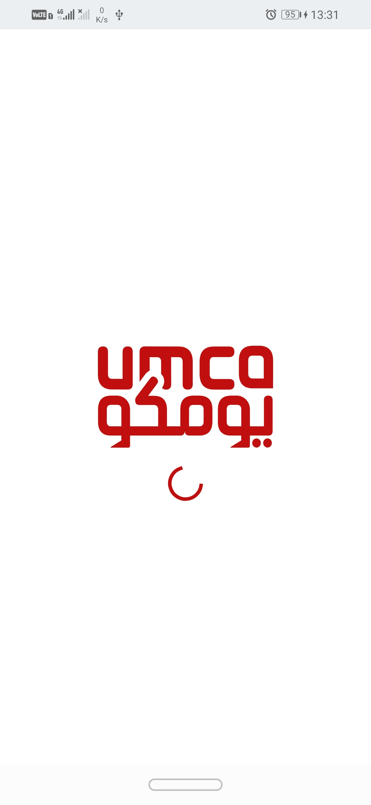 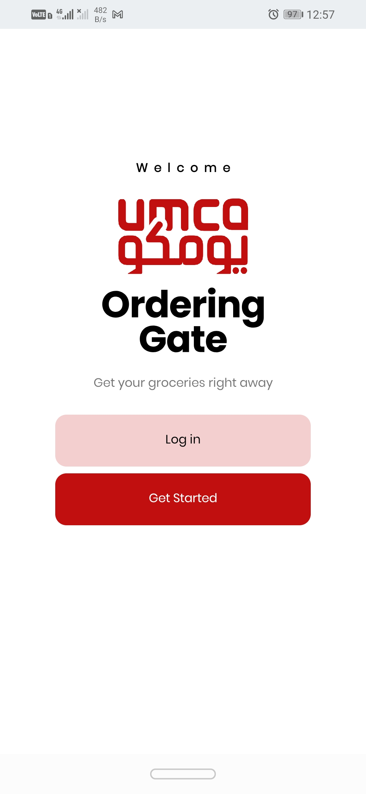
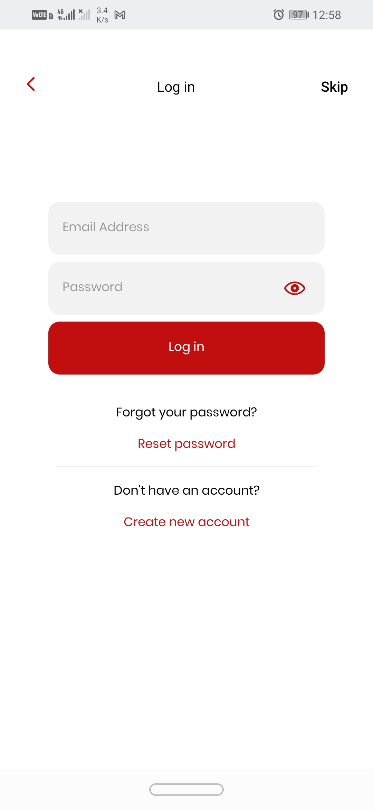
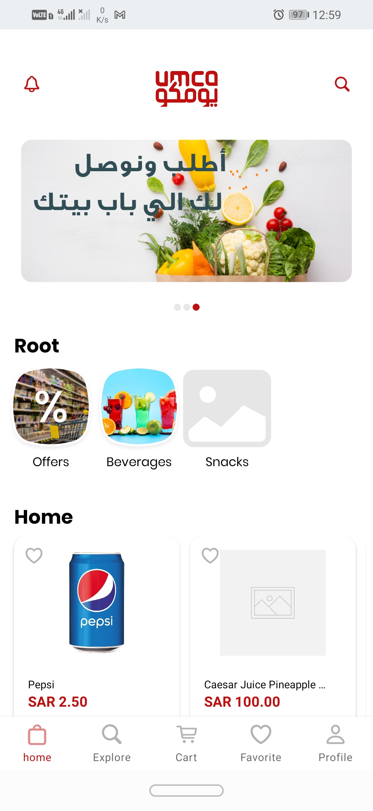
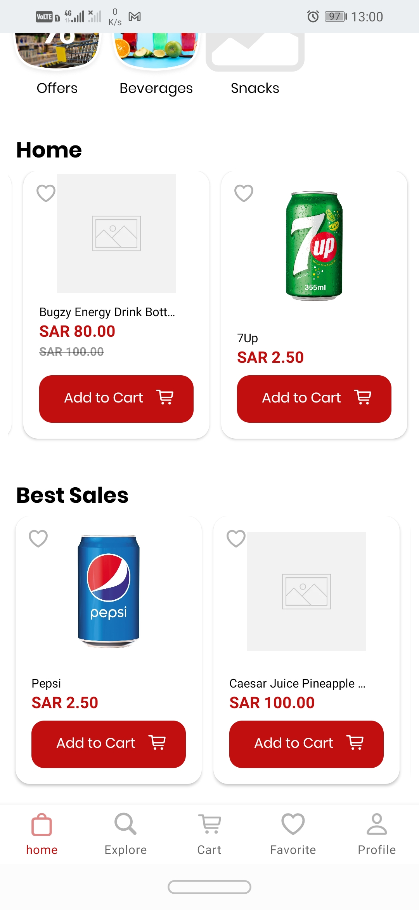
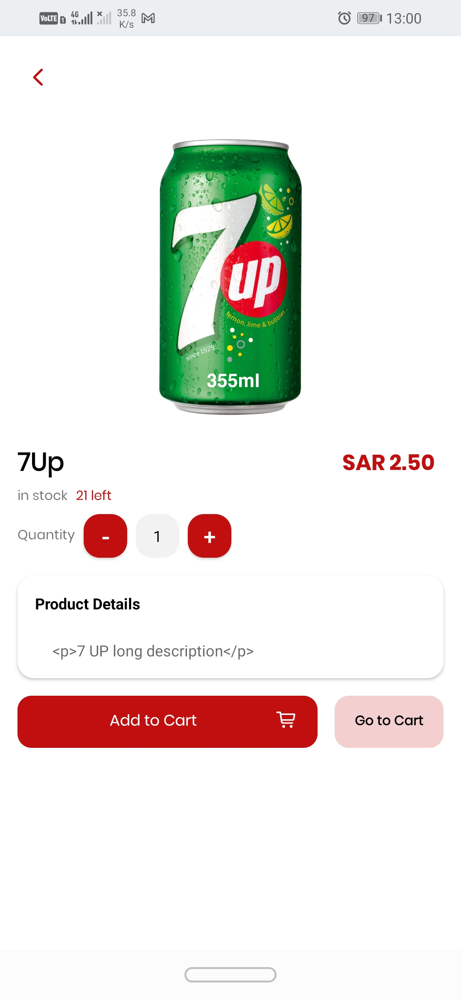

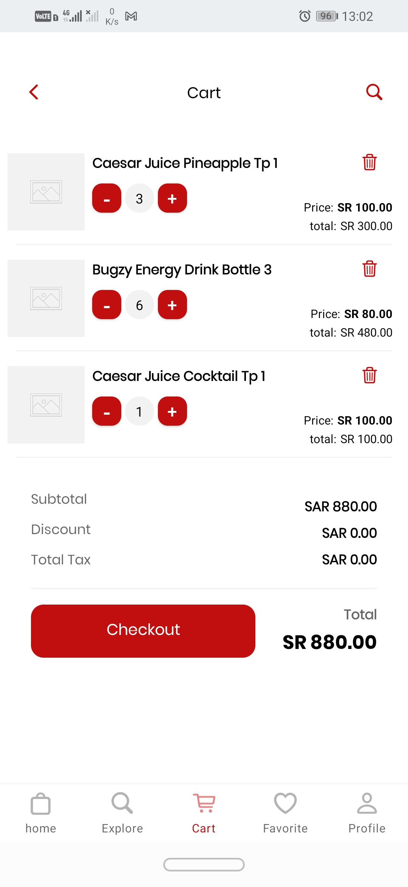
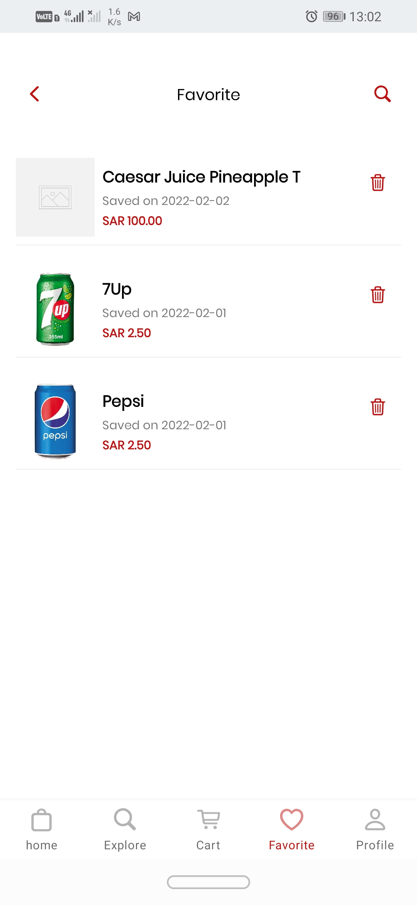
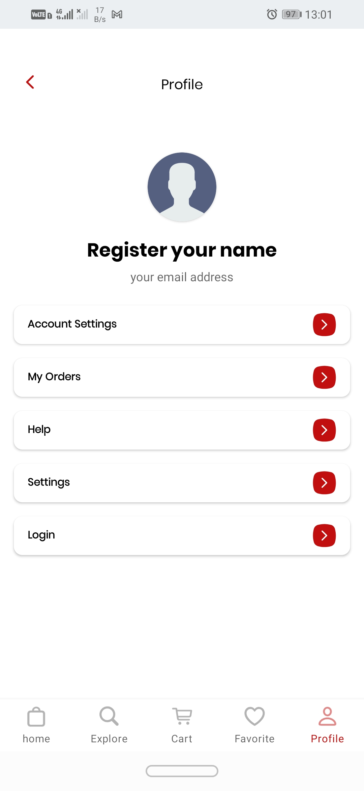


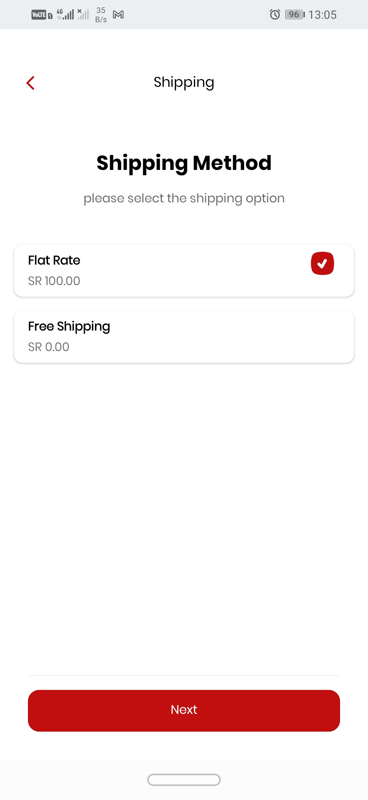
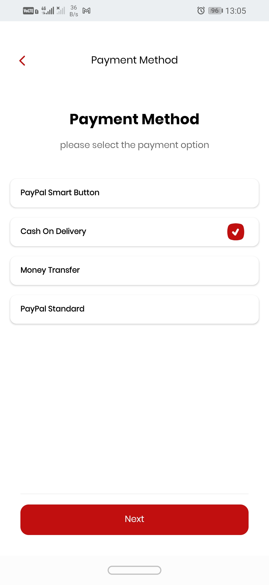


## Technologies

#### Languages:
- Kotlin 
- Xml

#### Architecture patterns:
- MVVM

#### Libraries:
- Retrofit    2.9.0 (https://square.github.io/retrofit/)
- Gson        2.9.0 (https://github.com/google/gson)
- Room        2.4.2 (https://developer.android.com/training/data-storage/room)
- Picasso     2.71828 (https://square.github.io/picasso/)
- Coroutine   1.6.1 (https://developer.android.com/kotlin/coroutines)
- Hilt        2.40.1 (https://developer.android.com/training/dependency-injection/hilt-android)
- Navigation  2.5.0-rc01 (https://developer.android.com/guide/navigation/navigation-getting-started?authuser=2)
- Lifecycle   2.4.1(https://developer.android.com/jetpack/androidx/releases/lifecycle)

## Setup

To run this project, install it by download or clone.
Then login using this data to test:
username: mohamedzaki
password: 12345

#### System requirements
- Android Studio Chipmunk | 2021.2.1
- Minimum sdk v21
- Target sdk v31
- Compile sdk v31

## YouTube link 

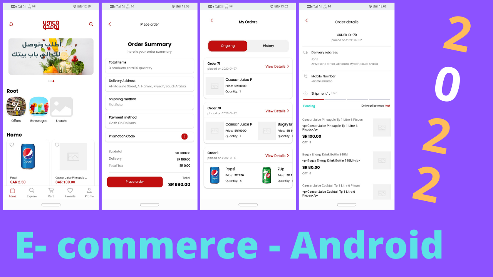

(https://youtu.be/70YzVmI3RcI)

## License

```html
MIT Licence 

Copyright (c) 2022 Ahmed Zaki

Permission is hereby granted, free of charge, to any person obtaining a copy of this software
and associated documentation files (the "Software"), to deal in the Software without restriction,
including without limitation the rights to use, copy, modify, merge, publish, distribute, sublicense,
and/or sell copies of the Software, and to permit persons to whom the Software is furnished to do so, 
subject to the following conditions:

The above copyright notice and this permission notice shall be included in all copies or substantial 
portions of the Software.

THE SOFTWARE IS PROVIDED "AS IS", WITHOUT WARRANTY OF ANY KIND, EXPRESS OR IMPLIED, 
INCLUDING BUT NOT LIMITED TO THE WARRANTIES OF MERCHANTABILITY, FITNESS FOR A PARTICULAR PURPOSE
AND NONINFRINGEMENT.IN NO EVENT SHALL THE AUTHORS OR COPYRIGHT HOLDERS BE LIABLE FOR ANY CLAIM,
DAMAGES OR OTHER LIABILITY, WHETHER IN AN ACTION OF CONTRACT,
TORT OR OTHERWISE, ARISING FROM, OUT OF OR IN CONNECTION WITH THE SOFTWARE
OR THE USE OR OTHER DEALINGS IN THE SOFTWARE.
```

